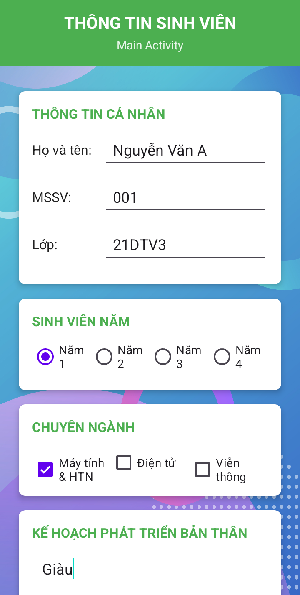
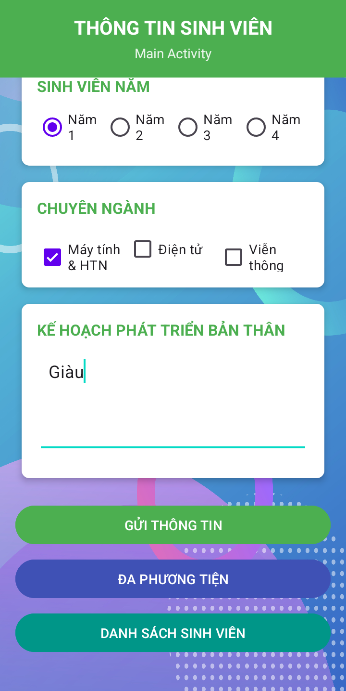
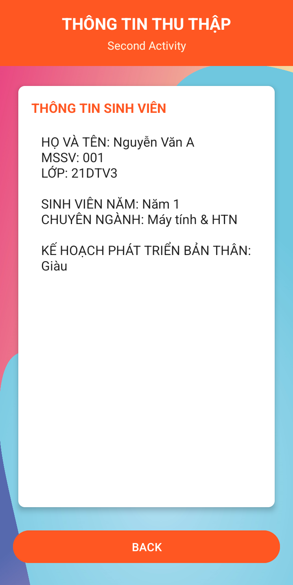
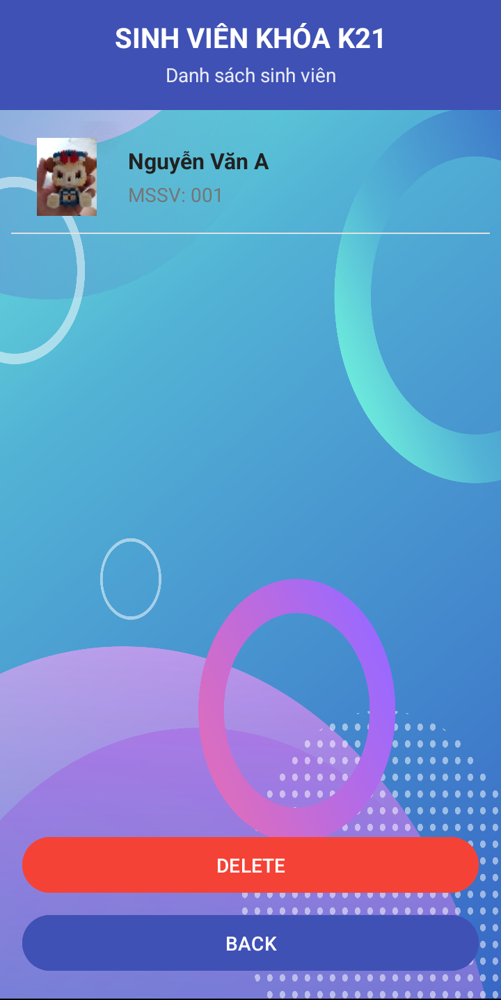
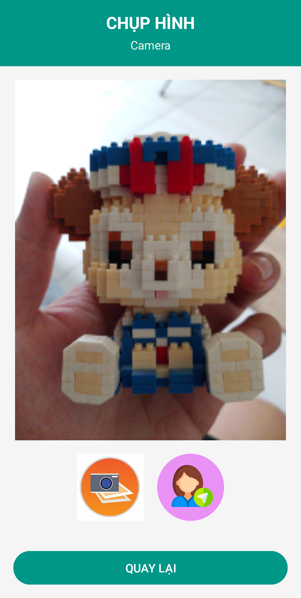

# Ứng dụng Quản lý Sinh viên và Đa phương tiện

Ứng dụng Android đa chức năng giúp quản lý thông tin sinh viên bằng SQLite và tích hợp các tiện ích đa phương tiện như gọi điện, nhắn tin, chụp ảnh và gán ảnh cho sinh viên.

## 📌 Mô tả

Ứng dụng được cải tiến từ [Thông tin sinh viên 2](https://github.com/Eggplant203/Thong-tin-sinh-vien-2) với các chức năng nổi bật như:

* Lưu trữ thông tin sinh viên vào **SQLite Database**
* Hiển thị danh sách sinh viên bằng **ListView**
* Cho phép **xem chi tiết** và **xóa** sinh viên khỏi danh sách
* Chụp ảnh từ camera và **gắn ảnh chụp vào avatar của sinh viên**
* Tích hợp các tiện ích đa phương tiện: **gọi điện**, **nhắn tin**, **camera**
* Yêu cầu quyền truy cập phù hợp trước khi sử dụng các tính năng hệ thống

## ✨ Tính năng chính

### 1. Quản lý thông tin sinh viên (qua SQLite)

* Nhập và kiểm tra thông tin sinh viên (họ tên, MSSV, lớp, năm học, chuyên ngành, kế hoạch)
* Lưu và hiển thị dữ liệu từ SQLite
* Danh sách sinh viên hiển thị bằng ListView
* Nhấn vào sinh viên để xem chi tiết
* Xóa sinh viên khỏi danh sách

### 2. Tính năng đa phương tiện

* **Gọi điện thoại** trực tiếp từ ứng dụng
* **Gửi SMS** đến số điện thoại bất kỳ
* **Chụp ảnh** từ camera
* **Gán ảnh chụp** làm avatar cho sinh viên được chọn

## 🖼 Hình ảnh giao diện

### Giao diện chính và chi tiết

|             Màn hình chính (1)             |             Màn hình chính (2)             |             Thông tin sinh viên            |
| :----------------------------------------: | :----------------------------------------: | :----------------------------------------: |
|  |  |  |

### Danh sách sinh viên và tính năng đa phương tiện

|            Danh sách sinh viên           |                  Đa phương tiện                  |                 Gửi tin nhắn                |                 Gọi điện                |                   Camera                   |
| :--------------------------------------: | :----------------------------------------------: | :-----------------------------------------: | :-------------------------------------: | :----------------------------------------: |
|  |  |  |  |  |

## 🧩 Cấu trúc Activity

* `MainActivity`: Nhập và lưu thông tin sinh viên
* `SecondActivity`: Hiển thị thông tin sinh viên
* `StudentListActivity`: Danh sách sinh viên từ SQLite
* `SelectStudentActivity`: Chọn sinh viên để gán ảnh hoặc xóa
* `DaPhuongTienActivity`: Chọn gọi, nhắn tin, camera
* `PhoneActivity`: Gọi điện thoại
* `SMSActivity`: Soạn và gửi tin nhắn
* `CameraActivity`: Chụp và gán ảnh cho sinh viên

## 🔄 Luồng hoạt động

1. Người dùng nhập thông tin sinh viên → Lưu vào SQLite
2. Có thể xem danh sách sinh viên đã lưu
3. Chọn sinh viên để xem chi tiết hoặc xóa
4. Chụp ảnh mới và gán ảnh cho sinh viên bất kỳ trong danh sách
5. Gọi điện hoặc gửi tin nhắn từ giao diện đa phương tiện

## 🔐 Quyền truy cập

Ứng dụng yêu cầu quyền sau:

* `CALL_PHONE`: Thực hiện cuộc gọi
* `SEND_SMS`: Gửi tin nhắn SMS
* `CAMERA`: Truy cập camera để chụp ảnh

## 🛠 Công nghệ

* **Java**, Android SDK
* **SQLite** để lưu trữ thông tin
* Intent, Activity, Runtime Permissions
* Camera API, Telephony API
* LinearLayout, ListView, CardView

## ⚙️ Yêu cầu hệ thống

* Android 14.0 (API level 34 - "UpsideDownCake") hoặc cao hơn
* Android Studio
* Thiết bị có camera, khả năng gọi điện và gửi tin nhắn SMS

## 🚀 Cài đặt

```bash
git clone https://github.com/Eggplant203/Thong-tin-sinh-vien-2-SQLite.git
```

1. Mở trong Android Studio
2. Sync Gradle
3. Cấp quyền trên thiết bị
4. Chạy ứng dụng trên thiết bị thật

## 📄 Giấy phép

Phát hành theo giấy phép MIT. Xem [LICENSE](./LICENSE) để biết chi tiết.

## 👨‍💻 Tác giả

© 2025 - Phát triển bởi **Eggplant203 🍆**

> *Dự án học tập nhằm thực hành xây dựng ứng dụng Android, xử lý dữ liệu với SQLite và tương tác với các API hệ thống.*